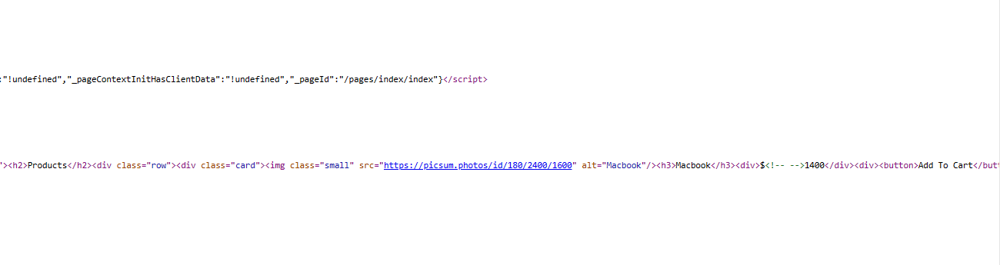
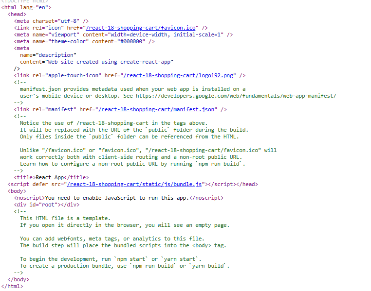

# Client-Side Rendering (CSR) vs. Server-Side Rendering

Client-Side Rendering means we render content on client end, while in server side rendering we prebuild the page on the server side and then send it to the client.

Here are 7 key differences between Server-Side Rendering (SSR) and Client-Side Rendering (CSR):

- **Rendering Location**: SSR renders pages on the server, while CSR renders pages on the client's web browser.
- **Initial Load**: SSR sends a fully rendered HTML page to the client on the initial load, while CSR sends a blank HTML page and loads content dynamically.
- **SEO**: SSR is better for Search Engine Optimization (SEO) as search engines can crawl the rendered HTML content, while CSR can make it difficult for search engines to crawl content generated dynamically.
- **Page Load Time**: SSR typically has faster page load times as the server generates the HTML, while CSR can take longer as the browser needs to load and execute JavaScript.
- **JavaScript Execution**: SSR executes JavaScript on the server, while CSR executes JavaScript on the client's browser.
- **State Management**: SSR requires server-side state management, while CSR uses client-side state management.
- **Caching**: SSR can leverage server-side caching, while CSR relies on client-side caching, which can be less effective due to browser cache limitations.

## What this project does?

This project is a simple shopping cart forked from https://github.com/basir/react-18-shopping-cart.git. Hats off to that amazing dev!

In the root directory, you will find two directories, `client-side-renderer` and `server-side-renderer`. 

To setup and run the project, open up both folders in separate directories and run the command `npm i`to install the dev dependencies.

## The Difference

Once the dev dependencies are installed, run the commands `npm run start` in the client-side-renderer.

Similarly, run the command `npm run dev` in the server-side-renderer.

Once they are both open, go to the page source in both of them. In the server-side one, you should see an output like this:

This is basically the list of all products in the html, showing the use of server-side-render.

In the client-side, you should see an empty div.

You can see by the comments in the div.root that the content is fed in dynamically.

### Steps to convert CSR into SSR

In the Server-side project, a ReadME.md outlines the steps to do this.

